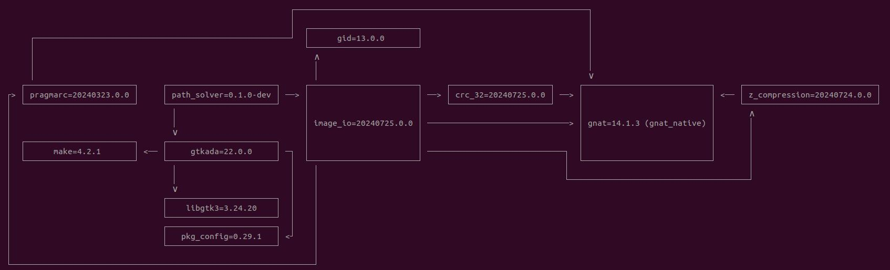

# A Beautiful World

## Description

This project is a fork of one of my old project [Path_Solver](https://github.com/Akutchi/Path_Solver)
and as such I highly recommend you go check out the [World Generation Section](https://github.com/Akutchi/Path_Solver?tab=readme-ov-file#world-generation) before going further.

This project is a fork because I wanted to use the Terrain generation algorithm
that I had implemented to go in another direction this time. Namely, World Simulation.

## Configuration

### Introduction

The project use Alire as its main compiling tool.

To install Alire, please download the [binary file](https://alire.ada.dev/) and unpack it somewhere. Then, add Alire to the path with\
```export PATH="<PATH_TO_EXTRACTED>/bin/:$PATH"``` (you can make it permanent by placing this in the .profile).

### Dependency

To run, the project must use some dependencies. To install them using alire, please run the command\ ```alr with <Dependency>```.
The graph of all the project's dependencies can be found below.

|  |
|:--:|
| *The project's dependency graph* |

### Build

To build the project, run ```alr build``` in the project folder, or
alternatively ```alr run``` to build and execute. The generated binary file is located in ./bin and must be executed here.

There is currently to binaries associated with the project :
- path_solver : the main program visualizing Dijkstra's algorithm
- generation_main : the program that creates the procedural map. It is a test file for developpement purposes. Its result can be seen on the last layer in [layer/templates](./layer_templates/).
